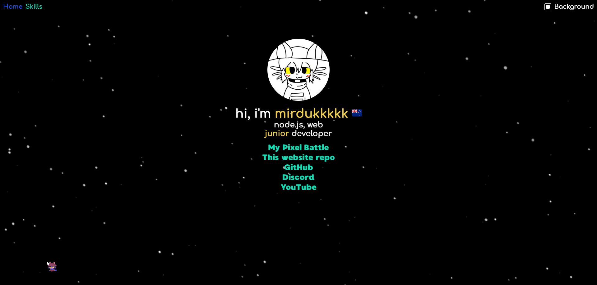

 

  
This page also available in **English** | [Indonesian](./docs/indonesian/README.md) | [Russian](./docs/russian/README.md)

## What does the project use?
This project uses [Typescript](https://www.typescriptlang.org/), [Vite](https://vitejs.dev/), [Preact](https://preactjs.com/), and my interest  
**Other libraries** can be found in [package.json](./package.json)

## How to use it?
This is as simple as it gets! Just:
1. Get [Node.JS](https://nodejs.org/) and install it
2. Use the yarn package manager (`npm i -g yarn`)
3. Download or clone the project, go to its root
4. Set up dependencies via `yarn install`
5. Build the project using `yarn build`
6. Run it using `yarn run preview`
7. After all these steps, you can access the site via https://localhost:4750

**If you don't want to go through all those steps**, you can just check out the site at https://mirdukkkkk.space

## Screenshots

## Stars are animated! (and switchable)
